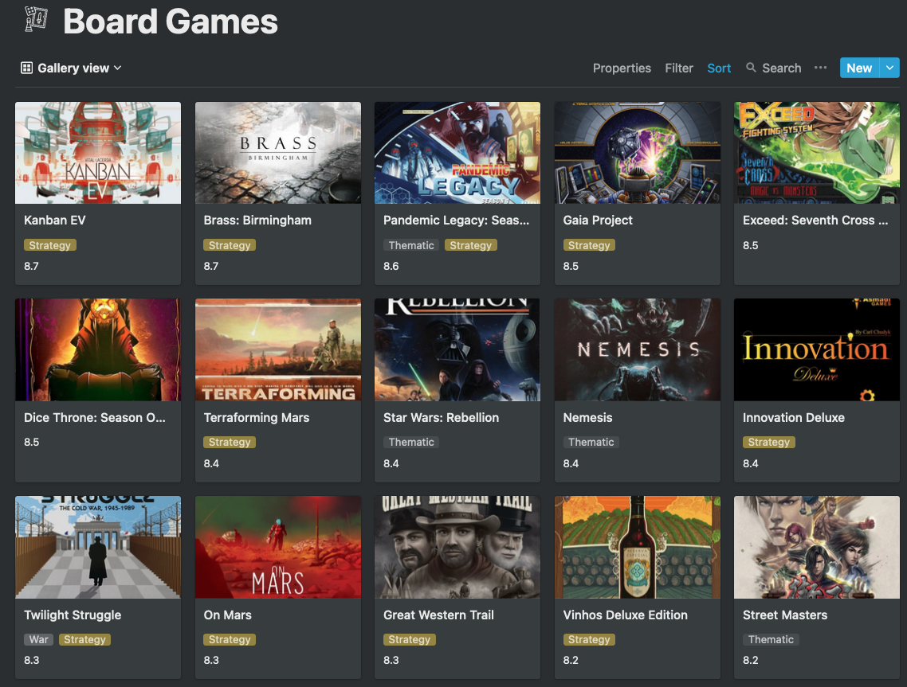

# BGG-Notion

Manage your board game collections from [BGG](https://boardgamegeek.com/) as a [Notion](https://www.notion.so/) database.

Integrates Notion's [API](https://developers.notion.com/) with the [XML API](https://boardgamegeek.com/wiki/page/BGG_XML_API2) provided by BGG. Please follow the first two steps [here](https://developers.notion.com/docs) to create a Notion secret and find the database ID. 

Each game is a sub-page in the database, with the name of the game as the sub-page's title. The image link, game category, bgg average rating, user's ratings, user's review and the BGG link are extracted and stored as properties of the sub-page. Specifically, the image link is stored as "Files & media" type and it can be displayed nicely as the "Card preview" in the gallary view.

## TODO
- [x] Download the collections from BGG to a Notion database.
- [ ] Update contens on BGG website when changes are made in the Notion database.
- [ ] Update contens in the Notion databse when changes are made on BGG website.
(*Basically create a two way sync between the Notion database and the BGG website.*)
- [ ] Error handlings